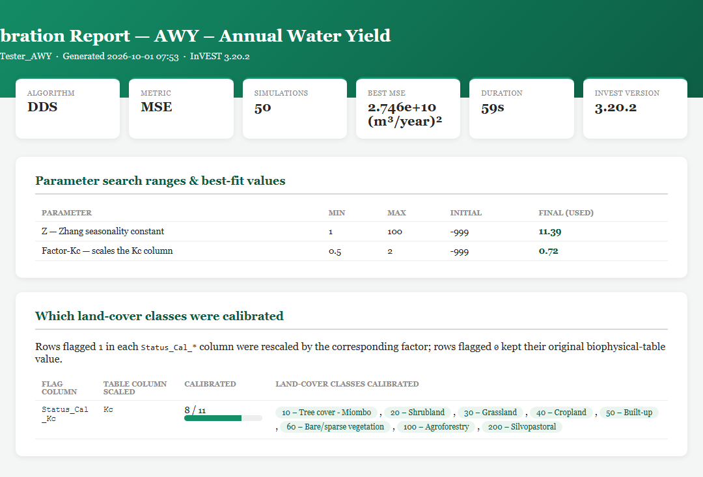
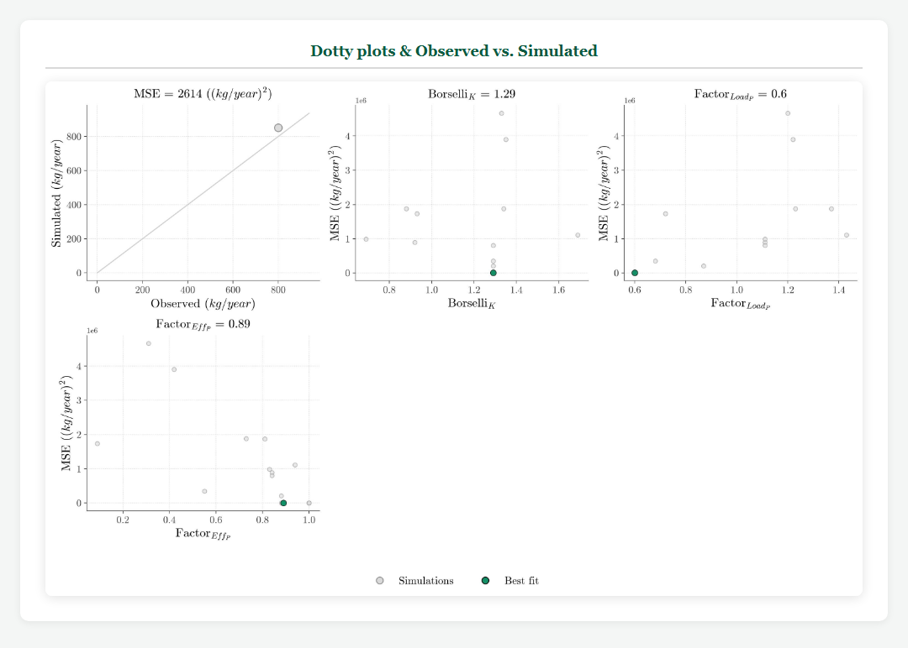
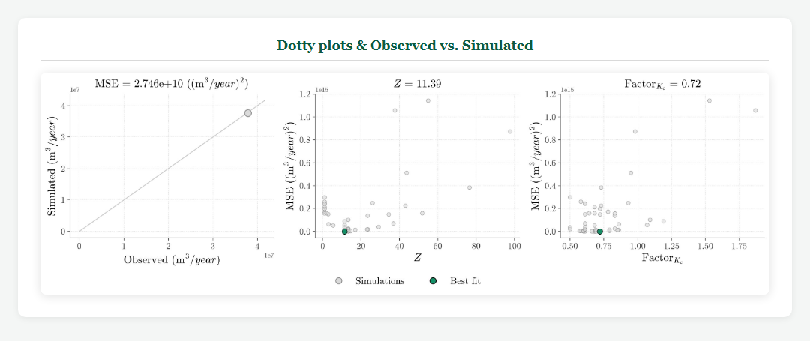
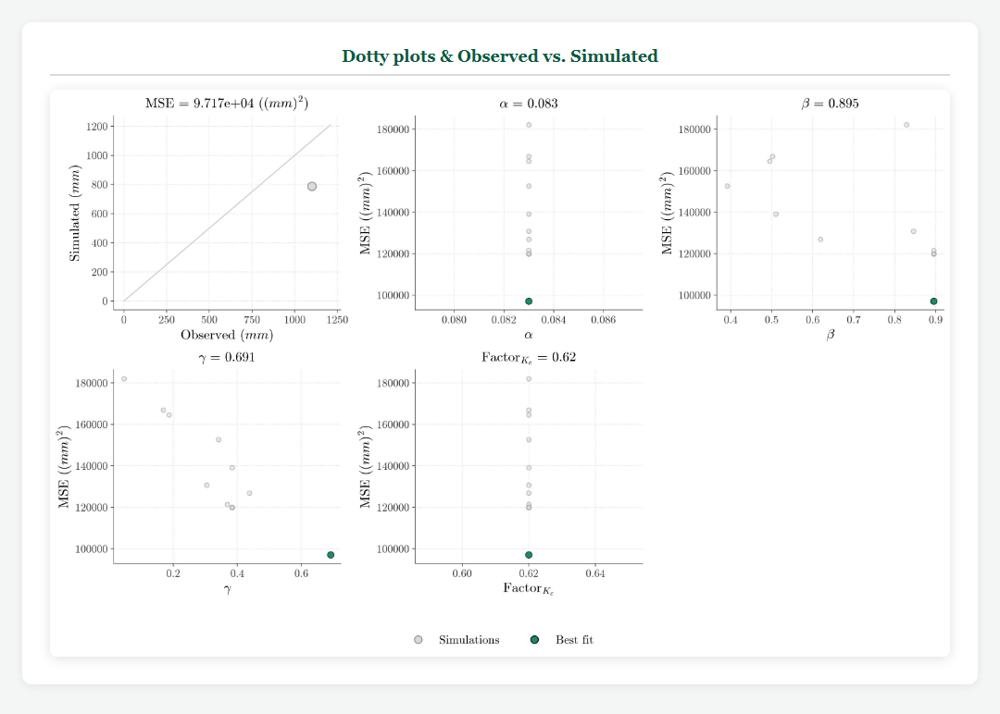
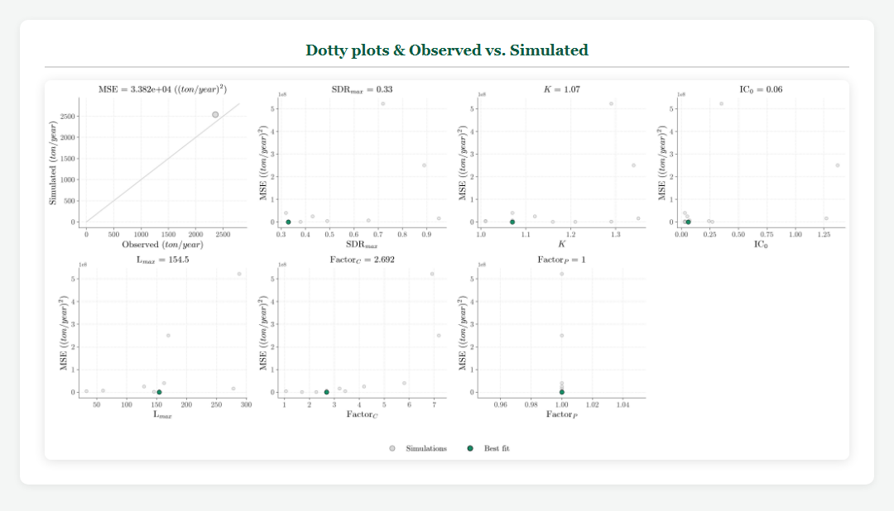
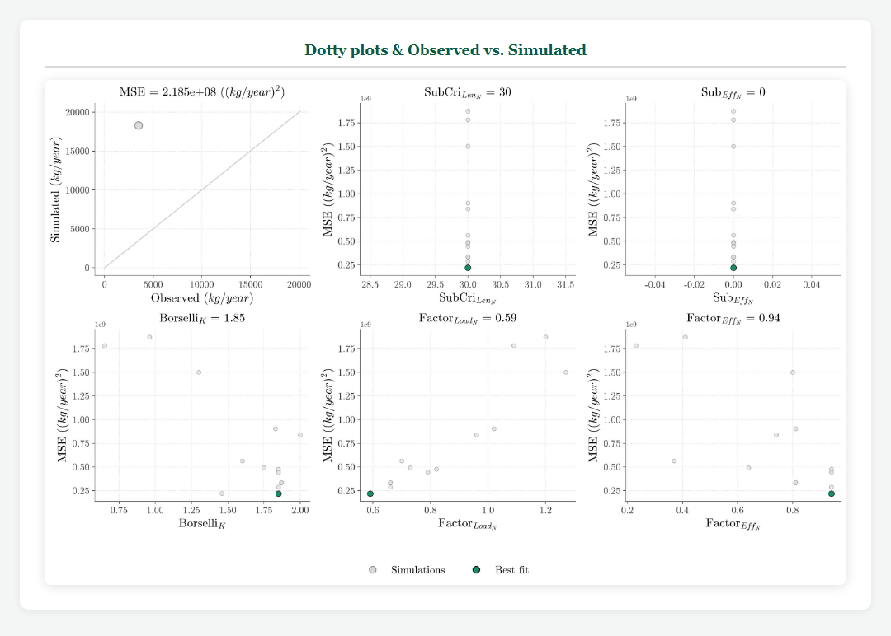

# InVEST Calibration Assistant — User Manual

**Plugin 1.0.0 · InVEST engine 3.20.2 · October 2026**

A practical guide for calibrating InVEST models with the **InVEST Calibration Assistant** Workbench plugin: what to prepare, how to run it, how to read what it produces, and how to reuse the calibrated results.

For the theory behind the calibration loop, the `Status_Cal_*` mechanism, multi-gauge setups and dotty-plot interpretation, see [CALIBRATION_PROCESS.md](CALIBRATION_PROCESS.md).

## Contents

1. [What the plugin does](#1-what-the-plugin-does)
2. [Installation](#2-installation)
3. [Quick start with the dummy dataset](#3-quick-start-with-the-dummy-dataset)
4. [Preparing your inputs](#4-preparing-your-inputs)
5. [Filling in the Workbench form](#5-filling-in-the-workbench-form)
6. [Choosing the algorithm, metric and number of simulations](#6-choosing-the-algorithm-metric-and-number-of-simulations)
7. [Reading the results](#7-reading-the-results)
8. [Reusing the calibrated results](#8-reusing-the-calibrated-results)
9. [Model-specific notes](#9-model-specific-notes)
10. [Good calibration practice](#10-good-calibration-practice)
11. [Troubleshooting](#11-troubleshooting)
12. [References](#12-references)

---

## 1. What the plugin does

For each iteration, the plugin:

1. takes one candidate set of parameters proposed by the optimizer (Spotpy),
2. applies the `Factor*` multipliers to the flagged rows of the biophysical table,
3. runs the selected InVEST model over the **calibration watersheds**,
4. extracts the simulated response of each watershed and compares it with the observations using the chosen metric.

When all iterations are done, it picks the best candidate, runs InVEST once more with it over the **full watersheds**, and writes the parameter tables, figures, an HTML report and a set of README files.

It calibrates **one model per run**. The response it compares against your observations is:

| Model | Simulated response the plugin reads | Observed data units |
|---|---|---|
| **AWY** – Annual Water Yield | `wyield_vol` from the watershed results table | m³/year |
| **SWY** – Seasonal Water Yield | Zonal **mean** of `intermediate_outputs/aet_<suffix>.tif` (actual evapotranspiration) | mm/year |
| **SDR** – Sediment Delivery Ratio | `sed_export` from the watershed results | tonnes/year |
| **NDR_N** – Nitrogen | Zonal **sum** of `n_total_export_<suffix>.tif` (surface + subsurface) | kg/year |
| **NDR_P** – Phosphorus | Zonal **sum** of `p_surface_export_<suffix>.tif` | kg/year |

> **SWY calibrates actual evapotranspiration (AET), not streamflow or baseflow.** Supply basin-average annual AET in mm/year.

Calibrated parameters per model:

| Model | Parameters |
|---|---|
| AWY | `Z`, `Factor-Kc` |
| SWY | `Alpha`, `Beta`, `Gamma`, `Factor-Kc_m` |
| SDR | `sdr_max`, `Borselli-K_SDR`, `Borselli-IC0`, `L_max`, `Factor-C`, `Factor-P` |
| NDR_N | `SubCri_Len_N`, `Sub_Eff_N`, `Borselli-K_NDR`, `Factor_Load_N`, `Factor_Eff_N` |
| NDR_P | `Borselli-K_NDR`, `Factor_Load_P`, `Factor_Eff_P` |

Parameters starting with `Factor` are multipliers applied to biophysical-table columns. The others are direct InVEST model arguments.

---

## 2. Installation

1. Open the **InVEST Workbench**.
2. In the right sidebar, click **Manage Plugins** → **Add Plugin**.
3. Paste the repository URL and click **Install**:
   ```text
   https://github.com/N4W-Facility/Invest_Plugin_Calibration.git
   ```
4. Wait while the Workbench creates the plugin's own environment (InVEST, GDAL, Spotpy…). This needs internet access the first time.
5. Open **InVEST Calibration Assistant** from the model list.

The plugin runs in its own environment, so its InVEST engine version can differ from the Workbench version shown in the title bar. The engine version used is printed in the HTML report.

---

## 3. Quick start with the dummy dataset

The fastest way to learn the plugin is to run it on the dummy dataset:

> **[Download the dummy dataset](https://tnc.box.com/s/k91p9xhh1ujz127jqvw95sb6yajotfg3)**

### 3.1 Dataset contents

```text
Dummy_InVEST/
├── AWY_args.json            ← ready-to-load Workbench configurations
├── SWY_args.json
├── SDR_args.json
├── NDR_args.json            ← NDR_N
├── NDR_P_args.json          ← NDR_P
└── INPUTS/
    ├── 01-Biophysical_Table.csv   biophysical table with Status_Cal_* columns
    ├── Parameters_Table.csv       search ranges for all models
    ├── Calibration_Data.csv       observed values (one column per model)
    ├── LULC/LULC.tif
    ├── Basin_Cal/Basin_Cal.shp    calibration watershed(s)
    ├── Basin/Basin.shp            full watersheds for the final run
    ├── Basin/SubBasin.shp         optional sub-watersheds
    ├── P.tif, ETo.tif, SoilDepth.tif, PAWC.tif      annual rasters (AWY, NDR)
    ├── DEM.tif, SG.tif, R.tif, K.tif                 terrain, soils, erosion
    ├── P/P_1…12.tif, ETo/ETo_1…12.tif                monthly rasters (SWY)
    ├── P_Raster_Table.csv, ETo_Raster_Table.csv      month → raster tables (SWY)
    └── Rain_Events_Table.csv                         monthly rain events (SWY)
```

### 3.2 Running an example

1. Unzip the dataset anywhere on your machine.
2. In the plugin, use **Load parameters from file** and pick one of the `*_args.json` files.
3. All paths in the JSON files are **relative to the JSON file** and the workspace is `.`, so the form fills in correctly wherever you unzipped the folder. Results are written into `Dummy_InVEST/` itself.
4. Each configuration uses its own suffix (`Tester_AWY`, `Tester_SWY`, `Tester_SDR`, `Tester_NDR_N`, `Tester_NDR_P`), so all five models can run in the same folder without overwriting each other's suffixed files.
5. Click **Run**. The HTML report opens automatically when the run finishes.

The JSON files are also a good **reference** for your own projects: they show exactly which fields each model needs and what a valid value looks like.

### 3.3 What you should get

The reference runs use DDS, MSE, a stream threshold of 20 cells, and the configurations above. With so few simulations, your best values will differ from these: DDS is stochastic and the plugin does not expose a random seed.

| Model | Simulations | Best MSE | Final parameters |
|---|---:|---:|---|
| AWY | 50 | 2.75e+10 (m³/year)² | `Z` = 11.39, `Factor-Kc` = 0.72 |
| SWY | 15 | 9.72e+04 mm² | `Beta` = 0.895, `Gamma` = 0.691 (`Alpha`, `Factor-Kc_m` fixed) |
| SDR | 15 | 3.38e+04 (t/year)² | `sdr_max` = 0.33, `Borselli-K_SDR` = 1.07, `Borselli-IC0` = 0.06, `L_max` = 154.5, `Factor-C` = 2.69 (`Factor-P` fixed) |
| NDR_N | 15 | 2.19e+08 (kg/year)² | `Borselli-K_NDR` = 1.85, `Factor_Load_N` = 0.59, `Factor_Eff_N` = 0.94 (subsurface N fixed) |
| NDR_P | 15 | 2.61e+03 (kg/year)² | `Borselli-K_NDR` = 1.29, `Factor_Load_P` = 0.60, `Factor_Eff_P` = 0.89 |

The dummy dataset has a single calibration watershed and 15–50 simulations. It shows how the workflow operates. It is **not** a converged or scientifically meaningful calibration.

---

## 4. Preparing your inputs

### 4.1 Spatial data

- Use **projected** rasters and vectors (linear units, e.g. metres), ideally all in the same CRS.
- Every LULC code in the raster must have a row in the biophysical table. Extra rows are fine.
- Watershed shapefiles need an **integer `ws_id`** field that is unique per polygon. Keep all sidecar files (`.shp`, `.shx`, `.dbf`, `.prj`) together.
- **Calibration Watersheds** are the polygons that have observations. **Full Watersheds** are used only for the final run; they may be larger or more numerous.
- Check the DEM and stream threshold before calibrating. Parameter calibration cannot fix a wrong drainage network.

### 4.2 Observed data (`Calibration_Data.csv`)

One row per calibration watershed, one column per model:

```csv
ws_id,AWY,SWY,SDR,NDR_N,NDR_P
1,37843200,1100,2358.624984,3500,800
```

- `ws_id` must match the `ws_id` of the calibration watersheds. Only watersheds present in **both** are used; unmatched ones are silently skipped. Check the IDs yourself before running.
- Only the column of the model you calibrate needs data. Use plain numbers, with a period as the decimal separator and no thousands separators or units.
- Units: AWY m³/year · SWY mm/year (AET) · SDR tonnes/year · NDR_N and NDR_P kg/year.

Common conversions:

```text
Annual volume (m³/year) = mean discharge (m³/s) × 31,536,000
Load (kg)               = Σ [ C (mg/L) × Q (m³/s) × Δt (s) × 0.001 ]
Load (tonnes)           = Load (kg) / 1,000
```

For nested gauges, the plugin does not subtract upstream from downstream observations. If you use incremental (inter-basin) polygons, supply incremental loads or volumes. See [CALIBRATION_PROCESS.md §5](CALIBRATION_PROCESS.md#5-multi-gauge-control-points-under-a-steady-state-formulation).

### 4.3 Parameter search ranges (`Parameters_Table.csv`)

One file can hold all models; the plugin reads only the rows it needs.

```csv
Params,Model,Min,Max,Value
Z,AWY,1,100,10
Factor-Kc,AWY,0.5,2,1
Alpha,SWY,0.083,0.083,0.083
```

| Column | Meaning |
|---|---|
| `Params` | Exact parameter key (case-sensitive), see the table below. |
| `Model` | Informational only. |
| `Min`, `Max` | Search range. **Set `Min = Max` to hold a parameter fixed.** |
| `Value` | Initial guess. It is reported as `Initial` and is used **only if the calibration produces no valid best fit**. |

> **Tip:** always fill in `Value` with a physically sensible number (the dummy table uses `1` for factors, i.e. no change, and InVEST defaults clipped to the range for the rest). A placeholder such as `-999` would be used as-is by the final run if no best fit is found.

Parameter keys:

| Key | Model | Meaning | Unit |
|---|---|---|---|
| `Z` | AWY | Zhang seasonality constant | – |
| `Factor-Kc` | AWY | Multiplier for `Kc` | – |
| `Alpha` | SWY | Fraction of upslope annual available recharge available each month | – |
| `Beta` | SWY | Fraction of the upgradient subsidy available for ET | – |
| `Gamma` | SWY | Fraction of pixel recharge available to downgradient pixels | – |
| `Factor-Kc_m` | SWY | Multiplier for monthly `Kc_1` … `Kc_12` | – |
| `sdr_max` | SDR | Maximum sediment delivery ratio | – |
| `Borselli-K_SDR` | SDR | Borselli k (connectivity) | – |
| `Borselli-IC0` | SDR | Borselli IC₀ (connectivity threshold) | – |
| `L_max` | SDR | Maximum hillslope length | m |
| `Factor-C`, `Factor-P` | SDR | Multipliers for `usle_c`, `usle_p` | – |
| `SubCri_Len_N` | NDR_N | Subsurface critical length for N | m |
| `Sub_Eff_N` | NDR_N | Subsurface maximum retention efficiency for N | – |
| `Borselli-K_NDR` | NDR_N, NDR_P | Borselli k for NDR | – |
| `Factor_Load_N`, `Factor_Eff_N` | NDR_N | Multipliers for `load_n`, `eff_n` | – |
| `Factor_Load_P`, `Factor_Eff_P` | NDR_P | Multipliers for `load_p`, `eff_p` | – |

Note the model-specific keys `Borselli-K_SDR` and `Borselli-K_NDR`; a generic `Borselli-K` is not recognized. If a required row is missing, the plugin falls back to a 0–1 range, which is rarely what you want. Include every row for your model.

> NDR_P has **no subsurface parameters**: InVEST models subsurface transport for nitrogen only.

### 4.4 Biophysical table and `Status_Cal_*` flags

Besides the standard InVEST columns, the table needs one **0/1 flag column** per calibrated factor. A `1` means that land cover's value is multiplied by the factor; a `0` keeps the original value.

| Flag column | Model | Column it scales | Factor | Rounding | Upper cap |
|---|---|---|---|---|---|
| `Status_Cal_Kc` | AWY | `Kc` | `Factor-Kc` | 2 decimals | 1.2 |
| `Status_Cal_Kc` | SWY | `Kc_1` … `Kc_12` | `Factor-Kc_m` | 2 decimals | 1.2 |
| `Status_Cal_C` | SDR | `usle_c` | `Factor-C` | 5 decimals | 1 |
| `Status_Cal_P` | SDR | `usle_p` | `Factor-P` | 2 decimals | 1 |
| `Status_Cal_Load_N` | NDR_N | `load_n` | `Factor_Load_N` | 3 decimals | none |
| `Status_Cal_Eff_N` | NDR_N | `eff_n` | `Factor_Eff_N` | 2 decimals | none |
| `Status_Cal_Load_P` | NDR_P | `load_p` | `Factor_Load_P` | 3 decimals | none |
| `Status_Cal_Eff_P` | NDR_P | `eff_p` | `Factor_Eff_P` | 2 decimals | none |

- Column names are case-sensitive: `Kc`, `Kc_1`…`Kc_12`, `Status_Cal_*` exactly as shown.
- A single factor is shared by **all** flagged classes. Classes are not calibrated individually.
- Factors are always applied to the **original** table, so they never compound between iterations.
- **Efficiencies are not capped.** Choose `Factor_Eff_*` bounds so that `eff × factor` stays ≤ 1 for every flagged class.
- To calibrate every class, set the flag column to `1` on every row.
- NDR: if the table has no `load_type_n` / `load_type_p` column, the plugin adds it with `measured-runoff`. Add it yourself if your loads are application rates.

### 4.5 SWY monthly tables

SWY takes two CSV tables that map each month to a raster, plus a rain-events table:

```csv
month,path
1,ETo/ETo_1.tif
2,ETo/ETo_2.tif
...
12,ETo/ETo_12.tif
```

```csv
month,events
1,16
2,15
```

- 12 rows, months 1–12. Paths may be relative to the CSV file.
- Monthly rasters hold **monthly totals** (mm/month), not annual values.

---

## 5. Filling in the Workbench form

The form shows only the fields required by the selected model.

| Field | AWY | SWY | SDR | NDR_N/P | Notes |
|---|:-:|:-:|:-:|:-:|---|
| Workspace | ● | ● | ● | ● | Output folder (see §7.3 on overwriting) |
| Name Of The Model To Calibrate | ● | ● | ● | ● | |
| Land Use / Land Cover | ● | ● | ● | ● | |
| Biophysical Table | ● | ● | ● | ● | With `Status_Cal_*` columns |
| Calibration Watersheds | ● | ● | ● | ● | Polygons with observations, `ws_id` |
| Full Watersheds (Final Run) | ○ | ○ | ○ | ○ | Blank = calibration watersheds are reused |
| Sub-Watersheds | ○ | – | ○ | ○ | Passed to InVEST; ignored by SWY |
| Threshold Flow Accumulation | – | ● | ● | ● | Cells needed to start a stream |
| Project Name / Suffix | ○ | ○ | ○ | ○ | Appended to output names; letters, digits, `_`, `-` |
| Annual Precipitation | ● | – | – | ● | mm/year; runoff proxy for NDR |
| Reference Evapotranspiration | ● | – | – | – | mm/year |
| Root Restricting Layer Depth | ● | – | – | – | mm |
| Plant Available Water Content | ● | – | – | – | fraction 0–1 |
| Digital Elevation Model | – | ● | ● | ● | m |
| Hydrologic Soil Group | – | ● | – | – | integer 1–4 (A–D) |
| Monthly ETP / Precipitation Raster Table | – | ● | – | – | §4.5 |
| Rain Events Table | – | ● | – | – | §4.5 |
| Rainfall Erosivity (R) / Soil Erodibility (K) | – | – | ● | – | |
| Table Of Parameter Search Ranges | ● | ● | ● | ● | §4.3 |
| Table Of Observed Data | ● | ● | ● | ● | §4.2 |
| Evaluation Metric / Optimization Method | ● | ● | ● | ● | §6 |
| Number Of Simulations | ● | ● | ● | ● | ≥ 10 |

● required · ○ optional · – not used

**Workflow:** load or fill in the form → fix any validation messages → **Run** → follow the **Log** tab → the report opens at the end. Use **Cancel Run** to stop. A cancelled run cannot be resumed, so start again.

---

## 6. Choosing the algorithm, metric and number of simulations

| Method | How it searches | When to use it |
|---|---|---|
| **DDS** – Dynamically Dimensioned Search | Starts broad, then perturbs fewer parameters around the best solution | Default choice; good with limited budgets (≈ 50–500 runs) |
| **LHS** – Latin Hypercube Sampling | Stratified random sampling; does not adapt | Exploring the parameter space and sensitivity |
| **SCE-UA** – Shuffled Complex Evolution | Population-based evolution | Larger budgets, complex response surfaces |

| Metric | Formula | Unit |
|---|---|---|
| MSE | mean((Sim − Obs)²) | response unit² |
| RMSE | √MSE | response unit |
| MAE | mean(\|Sim − Obs\|) | response unit |
| RRMSE | RMSE / mean(Obs) | dimensionless |

All metrics are minimized (lower is better). RRMSE helps when watersheds differ a lot in size; squared metrics are dominated by the largest watersheds.

**Number of simulations:** the minimum accepted is 10. Each simulation is a full InVEST run, so check the duration of a short run first (it is shown in the report) and scale up from there.

---

## 7. Reading the results

### 7.1 Workspace layout

```text
<workspace>/
├── README_<MODEL>_<suffix>.md        ← START HERE
├── REPORT/Report_<MODEL>_<suffix>.html
├── FIGURES/Calibration_<MODEL>_<suffix>.jpg
├── PARAMETERS/
│   ├── <MODEL>_BestParams_<suffix>.csv
│   ├── <MODEL>_BioTable_Calibrated_<suffix>.csv
│   ├── <MODEL>_<METHOD>.csv             Spotpy raw log
│   └── README_<MODEL>_<suffix>.md
├── EVALUATIONS/
│   ├── <MODEL>_Metric_<suffix>.csv
│   ├── <MODEL>_Sim_<suffix>.csv
│   ├── <MODEL>_Obs_<suffix>.csv
│   └── README_<MODEL>_<suffix>.md
├── OUTPUTS/
│   ├── <MODEL>_best/                    ← final InVEST run with the calibrated parameters
│   └── 01-AWY, 02-SWY, 03-SDR, 04-NDR_N, 04-NDR_P   working folder (last iteration)
└── TMP/                                 last-iteration table and zonal stats; safe to delete
```

Several models can share one workspace: each file carries the model name and suffix.

### 7.2 What to open, in order

**1. The workspace README** (`README_<MODEL>_<suffix>.md`). It contains the best metric, the final parameter table, a "where to start" list and a map of the files of this run. The `PARAMETERS/` and `EVALUATIONS/` folders have their own READMEs explaining every column.

**2. The HTML report** (`REPORT/`). It opens automatically and is self-contained (the figure is embedded), so it can be shared as a single file.



Read it top to bottom:

- **Summary cards:** algorithm, metric, number of simulations, best metric, duration and InVEST version.
- **Optimization algorithm / Inputs used:** confirm these are the files you meant to use.
- **Parameter search ranges & best-fit values:** `Final (used)` is the value of the final run. If it sits at `Min` or `Max`, the optimum may lie outside the range.
- **Which land-cover classes were calibrated:** how many classes each `Status_Cal_*` flag changed, and which ones. This counts table rows; a class may be listed even if it has no pixels in the raster.
- **Dotty plots & Observed vs. Simulated:** see below.
- A **red banner** at the top means no valid best fit was found and the initial guesses (`Value`) were used. Do not report those values as calibrated.

**3. The calibration figure.** The top-left panel plots observed against simulated values for the best run, one point per calibration watershed; points on the 1:1 line are a perfect fit. Each other panel is a **dotty plot**: every grey dot is one simulation (parameter value on the x-axis, metric on the y-axis), and the green dot is the best run.



| Dotty-plot shape | Meaning |
|---|---|
| Clear U / V with a narrow minimum | Sensitive, well-identified parameter |
| Flat horizontal cloud | The model barely responds to the parameter in this range |
| Wide flat minimum | Several values fit equally well (equifinality) |
| Best point at a range edge | Range may be too narrow, or a cap (§4.4) is active |
| Single vertical column | Parameter was fixed (`Min = Max`) |

More detail is in [CALIBRATION_PROCESS.md §10](CALIBRATION_PROCESS.md#10-interpreting-dotty-plots).

**4. `PARAMETERS/<MODEL>_BestParams_<suffix>.csv`** — the final parameter table:

```csv
Params,Model,Min,Max,Value,Initial,Unit,Description,Near_Bound,Source
Z,AWY,1,100,11.39,-999,dimensionless,Zhang seasonality constant,,calibrated
Factor-Kc,AWY,0.5,2,0.72,-999,dimensionless,scales the Kc column,,calibrated
```

- `Value` is the **final** value. `Initial` is the `Value` from your input table.
- `Near_Bound` is `Min` or `Max` when the final value lies within 2 % of that end of the range.
- `Source` is `calibrated`, or `initial guess (no best fit found)` when the fallback was used.

**5. `PARAMETERS/<MODEL>_BioTable_Calibrated_<suffix>.csv`** — your input biophysical table with the calibrated factors applied to the flagged rows. It is exactly the table used by the final run.

**6. `OUTPUTS/<MODEL>_best/`** — the InVEST outputs of the final run over the full watersheds. **These are the calibrated results to use.** `OUTPUTS/01-AWY` (and its siblings) holds the *last* iteration, not the best one.

**7. `EVALUATIONS/`** — the full history, one row per iteration:

| File | Content |
|---|---|
| `<MODEL>_Metric_<suffix>.csv` | `iter`, the parameter values tried, and the metric |
| `<MODEL>_Sim_<suffix>.csv` | `iter`, then one `ws_<id>` column per watershed with the simulated value |
| `<MODEL>_Obs_<suffix>.csv` | One row: the observed value of each `ws_<id>` |

Join Metric and Sim on `iter`, and Sim and Obs on the `ws_<id>` columns. The metric here is always the true value (≥ 0, lower is better), even for DDS.

The Spotpy log `PARAMETERS/<MODEL>_<METHOD>.csv` is for debugging only. Its `like1` column is **−metric for DDS** (DDS maximizes), and its `simulation_*` columns are copies of the parameters, not simulated values.

### 7.3 Running again in the same workspace

- Same model and **same suffix**: every file of the previous run is replaced. The `EVALUATIONS/` CSVs are cleared at the start.
- Same model, **different suffix**: suffixed files are kept, but the Spotpy log, the `OUTPUTS/` folders and `TMP/` are overwritten.
- **To keep a run intact, copy the workspace or use a new one.**

---

## 8. Reusing the calibrated results

### 8.1 Refining the calibration

`BestParams` is directly usable as the **Table Of Parameter Search Ranges** of a new run: its first five columns follow the input format, and the other columns are ignored. Before reusing it:

- widen `Min`/`Max` for parameters flagged in `Near_Bound`, or
- narrow the range around `Value` for a local refinement.

Always start a new calibration from the **original** biophysical table, never from `BioTable_Calibrated`, or the factors would be applied twice.

### 8.2 Running InVEST with the calibrated parameters

To run the standard InVEST model (e.g. for scenarios):

1. Use `PARAMETERS/<MODEL>_BioTable_Calibrated_<suffix>.csv` as the biophysical table. InVEST ignores the extra `Status_Cal_*` columns.
2. Enter the non-`Factor` parameters from `BestParams` in the matching InVEST inputs:

| Plugin parameter | InVEST input |
|---|---|
| `Z` | Z parameter (AWY) |
| `Alpha`, `Beta`, `Gamma` | α, β, γ (SWY) |
| `sdr_max`, `Borselli-K_SDR`, `Borselli-IC0`, `L_max` | SDR max, Borselli k, Borselli IC₀, max L |
| `Borselli-K_NDR` | Borselli k (NDR) |
| `SubCri_Len_N`, `Sub_Eff_N` | Subsurface critical length (N), subsurface max retention efficiency (N) |

3. Match the plugin's fixed settings: SWY uses **D8** routing, a single (non-monthly) alpha and no user-defined climate zones or recharge; SDR and NDR use **MFD** routing.

For land-cover scenarios, remember that a factor was calibrated for the flagged classes under current conditions. Applying it to new classes is an assumption you need to justify.

---

## 9. Model-specific notes

### AWY – Annual Water Yield

- **Response:** `wyield_vol` (m³/year) of each calibration watershed.
- **Inputs:** annual precipitation, ETo, root restricting layer depth, PAWC. No DEM or stream threshold.
- **Table:** `Kc`, `root_depth`, `LULC_veg` + `Status_Cal_Kc`.
- **Outputs to inspect:** `OUTPUTS/AWY_best/output/watershed_results_wyield_<suffix>.csv`.



### SWY – Seasonal Water Yield

- **Response:** zonal mean of annual AET (mm/year). Do not supply discharge or baseflow observations.
- **Inputs:** DEM, hydrologic soil group, monthly ETo and precipitation tables, rain events table, stream threshold.
- **Table:** `Kc_1`…`Kc_12`, `CN_A`…`CN_D` + `Status_Cal_Kc`.
- **Fixed settings:** D8 routing, scalar `Alpha` (no monthly alpha table), no user-defined climate zones or local recharge.
- **Outputs to inspect:** `OUTPUTS/SWY_best/intermediate_outputs/aet_<suffix>.tif`, plus quickflow, baseflow and recharge products.



In the dummy run `Alpha` and `Factor-Kc_m` are fixed (`Min = Max`), so their panels show a single vertical column.

### SDR – Sediment Delivery Ratio

- **Response:** `sed_export` (tonnes/year) from the watershed results. This is delivered sediment, not gross erosion (`usle_tot`).
- **Inputs:** DEM, R, K, stream threshold.
- **Table:** `usle_c`, `usle_p` + `Status_Cal_C`, `Status_Cal_P`.
- **Outputs to inspect:** `OUTPUTS/SDR_best/watershed_results_sdr_<suffix>.shp`, `sed_export_<suffix>.tif`.
- Load factors (`Factor-C`) and delivery parameters (`sdr_max`, `Borselli-*`) can compensate for each other. Constrain at least one of them from independent information if you can.



### NDR_N – Nitrogen

- **Response:** sum of `n_total_export_<suffix>.tif` (surface + subsurface) over each calibration watershed (kg/year).
- **Inputs:** DEM, annual precipitation (runoff proxy), stream threshold.
- **Table:** `load_n`, `eff_n`, `crit_len_n`, `proportion_subsurface_n`, `load_type_n` + `Status_Cal_Load_N`, `Status_Cal_Eff_N`.
- If `proportion_subsurface_n` is 0 everywhere, `SubCri_Len_N` and `Sub_Eff_N` have no effect. Fix them (`Min = Max`) as in the dummy dataset.
- **Outputs to inspect:** `OUTPUTS/NDR_N_best/n_total_export_<suffix>.tif`, `watershed_results_ndr_<suffix>.gpkg` (open the GeoPackage in a GIS).



### NDR_P – Phosphorus

- **Response:** sum of `p_surface_export_<suffix>.tif` (kg/year). Phosphorus is surface-only in InVEST.
- **Inputs:** same as NDR_N.
- **Table:** `load_p`, `eff_p`, `crit_len_p`, `load_type_p` + `Status_Cal_Load_P`, `Status_Cal_Eff_P`.
- N and P are independent runs. A shared parameter such as `Borselli-K_NDR` can end up with different values in each.
- **Outputs to inspect:** `OUTPUTS/NDR_P_best/p_surface_export_<suffix>.tif`, `watershed_results_ndr_<suffix>.gpkg`.

---

## 10. Good calibration practice

- **Keep the number of free parameters small.** With one observation and several parameters, many combinations fit equally well. Fix (`Min = Max`) the parameters your data cannot constrain.
- **Use physically sensible bounds** and check that the scaled coefficients stay valid (Kc ≤ 1.2, C/P ≤ 1, efficiencies ≤ 1).
- **Look at the dotty plots, not just the best value.** A best value at a range edge, or a flat cloud, is information.
- **Run more than once.** DDS and SCE-UA are stochastic. Similar results across repeated runs make the result more trustworthy.
- **Validate separately.** Keep some watersheds or a separate period out of the calibration and evaluate the calibrated model on them. A good fit on the calibration data is not validation.
- **Archive each study:** input files, parameter and observation CSVs, the configuration JSON, the whole workspace (READMEs, report, BestParams, BioTable_Calibrated, EVALUATIONS) and the InVEST version from the report.

---

## 11. Troubleshooting

| Symptom | Likely cause | Fix |
|---|---|---|
| `KeyError: 'Status_Cal_…'` | Flag column missing or wrongly capitalized | Add the exact column for your model (§4.4) |
| `KeyError: 'Kc'` / `'Kc_1'` | Header in lower case | Use `Kc`, `Kc_1`…`Kc_12` |
| A parameter seems to have no effect | Wrong key, all flags 0, `Min = Max`, class not in the raster, or (NDR_N) `proportion_subsurface_n` = 0 | Check the key in §4.3, the flags and the calibrated table |
| Range 0–1 used for a parameter | Its row is missing from the parameter table | Add the row with the exact key |
| Fewer points in Obs vs Sim than expected | `ws_id` values do not match between shapefile and observations | Compare the two ID lists |
| Red banner in the report / `Source` = initial guess | No valid best fit; the `Value` column was used | Check the log for the error; fill in `Value` with sensible numbers |
| Efficiency above 1 in the calibrated table | `Factor_Eff_*` upper bound too high (not capped) | Lower the bound |
| SWY input error | Folder given instead of a table, missing months, bad paths | Use two 12-row `month,path` CSVs (§4.5) |
| "Must be ≥ 10" | Number Of Simulations below 10 | Use at least 10 |
| Old results mixed with new ones | Same workspace reused with a different suffix | Use a new workspace (§7.3) |
| Report did not open | Browser could not be launched | Open `REPORT/Report_<MODEL>_<suffix>.html` manually |
| File access error | An output is open in GIS or Excel | Close it and rerun |
| CRS warning on `TMP/Zonal_*` | Temporary zonal-stats file has no projection | Harmless; use the original polygons in a GIS |
| Spotpy remaining time jumps to ~24 h near the end | Spotpy estimate artefact | Ignore; follow the iteration count in the log |

---

## 12. References

- [Plugin repository](https://github.com/N4W-Facility/Invest_Plugin_Calibration)
- [CALIBRATION_PROCESS.md](CALIBRATION_PROCESS.md) — theory, loop mechanics, metrics, dotty plots, glossary
- [README.md](README.md) — overview, installation and changelog
- InVEST User's Guide: [Annual Water Yield](https://storage.googleapis.com/releases.naturalcapitalproject.org/invest-userguide/latest/en/annual_water_yield.html) · [Seasonal Water Yield](https://storage.googleapis.com/releases.naturalcapitalproject.org/invest-userguide/latest/en/seasonal_water_yield.html) · [SDR](https://storage.googleapis.com/releases.naturalcapitalproject.org/invest-userguide/latest/en/sdr.html) · [NDR](https://storage.googleapis.com/releases.naturalcapitalproject.org/invest-userguide/latest/en/ndr.html)
- Tolson & Shoemaker (2007), DDS · Duan et al. (1992), SCE-UA · Houska et al. (2015), Spotpy
